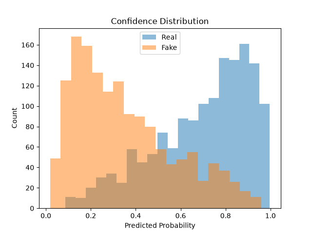

# Deekfake Face Detection

Binary image classifier that detects deepfake faces using transfer learning with a pretrained ResNet-18.

## How it works

The model uses a ResNet-18 pretrained on ImageNet as a feature extractor. All the pretrained layers are frozen and I replaced the last fully connected layer with a dropout layer and a single output neuron for binary classification (real vs fake). Hence, only the new final layer gets trained.

Images are resized to 224x224 pixels and normalized with ImageNet stats. Also, the training images get random horizontal flips for augmentation so the model doesn't just memorize what direction faces are normally supposed to be facing.

## Data

I used this [Real vs Fake 10k](https://www.kaggle.com/datasets/sachchitkunichetty/rvf10k/) dataset from Kaggle. The training set has 10k images (half real, half fake), which I split 80/20 into training and validation. I used the dataset's separate validation folder (3k images) as the test set.

## Results

The model gets about 78% accuracy on the test set with an AUC of 0.856.

### Training Curves

Training and validation loss both drop fast and flatten out around epoch 3-4. The validation accuracy (78%) ends up a bit higher than the training accuracy (75%), which seemed weird at first but it makes sense because the frozen pretrained layers behave the same in train and eval mode, and training images have random horizontal flips that make them slightly harder to classify. So the training set is the harder test.

### Confusion Matrix

|  | Predicted Fake | Predicted Real |
|---|---|---|
| Actually Fake | 1114 | 386 |
| Actually Real | 271 | 1229 |

The model has more false positives (386) than false negatives (271), so it's more likely to let a fake image through as "real" than to reject a real image as "fake."

### Confidence Distribution

The histogram of predicted probabilities shows decent separation between real and fake images but there's a good amount of overlap in the 0.3-0.7 range. The model isn't super confident about a lot of the images, which is consistent with the overall 78% accuracy.

### Threshold Analysis

Quick definitions: accuracy is the overall percentage the model gets correct, precision is how often the model is right when it predicts an image is "real," and recall is what fraction of actual real images it catches.

I tested different decision thresholds instead of just the default 0.5:

| Threshold | Accuracy | Precision | Recall |
|---|---|---|---|
| 0.3 | 0.703 | 0.630 | 0.973 |
| 0.4 | 0.753 | 0.684 | 0.913 |
| 0.5 | 0.781 | 0.761 | 0.819 |
| 0.6 | 0.773 | 0.831 | 0.699 |
| 0.7 | 0.733 | 0.891 | 0.571 |

There's a tradeoff between precision and recall. Lower thresholds catch more real images (high recall) but also let more fakes through (low precision). The 0.5 threshold is roughly where accuracy peaks. Depending on the use case of an image model, we'd want to appropriately tune this. Like if missing a deepfake has significant consequences, then we'd want to raise the threshold so the model is much stricter about what it considers "real."

### Error Analysis

I sorted the model's misclassified images by its prediction confidence, so I could see it's worst mistakes. The 10 top mistakes were images the model predicted as real with really high confidence (0.93-0.97 probability). The interesting thing is that these images are pretty obviously fake to my human eye. So the model is missing feature cues that are obvious to us. This makes sense considering it's a pretty simple model. I only trained the final layer and relied on ImageNet features, which were designed for general object recognition, not deepfake detection.

## Takeaways

This was an interesting project where I was able to apply some of what I learned over the summer from MIT's open-source introduction to deep learning course. I think it'd be cool to try unfreezing some of the later ResNet layers so the model could learn features more relevant to deepfake detection instead of relying on general purpose ImageNet features. I'd also want to try this on a larger dataset to see whether accuracy improves with more data or if the frozen layers were the real bottleneck.